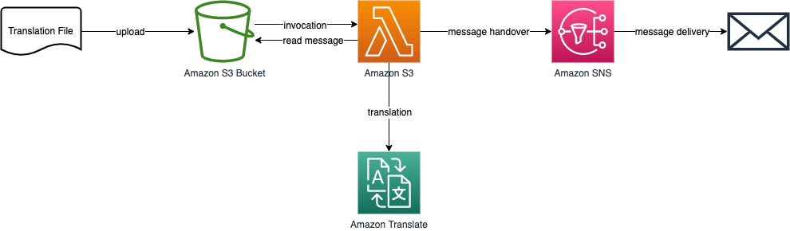

## Serverless translation example
This example demonstrated the capabilities and benefits of managed services on AWS. The solution described below is a very simple example and will lead to the following architecture:


### Create S3 Bucket
1. Create an empty bucket with default values


### Configure SNS
1. Create a new SNS topic with default settings
1. Create a new subscription and select **Email** as protocol and enter your E-Mail address as **Endpoint**
1. Confirm the subscription in the E-Mail you've received
1. From the **Topics** section in SNS, copy your Topic ARN (should look something like this arn:aws:sns:aws-region:aws-account-id:topicname)


### Lambda function
1. Create new Lambda function (Author from scratch)
1. Choose a name, for Runtime select **Python 3.10** and create the function
1. Replace existing function code and **deploy** the Lambda function
1. Review the Python code to understand what's supposed to happen during the invocation

```python
import boto3
import logging
import os

# Clients
s3 = boto3.client('s3')
translate = boto3.client('translate')
sns = boto3.client('sns')

# Configure logger
logger = logging.getLogger()
logger.setLevel(logging.INFO)

def lambda_handler(event, context):
    logger.info('Raw Event: {}'.format(event))
    print(event)
    
    # Extract Bucket- and Object names from Event Information
    bucket_name = event['Records'][0]['s3']['bucket']['name']
    object_name = event['Records'][0]['s3']['object']['key']

    # Get the object from S3
    fileobj = s3.get_object(
        Bucket=bucket_name,
        Key=object_name
    ) 
    
    # Open the file object and read it into the variable filedata. 
    filedata = fileobj['Body'].read()
    
    # file data will be a binary stream.  We have to decode it and store it as string
    content = str(filedata.decode('utf-8'))

    # Send content from the input file to AWS translate
    response_translate = translate.translate_text(
        Text=content,
        SourceLanguageCode='auto',
        TargetLanguageCode='de'
    )
    
    # Send the translated text as SMS to a recipient
    response_sns = sns.publish(
        TopicArn=os.environ['sns_topic'],
        Message=response_translate['TranslatedText']
    )
    
    return {
        'statusCode': 200,
        'body': response_sns
    }
```
1. Add a S3 trigger to your Lambda function and select the bucket created previously
1. Add an environment variable key **sns_topic** and paste your SNS Topic ARN
1. Under **Configuration** click on the **Role name** which will open a new windows in IAM

### IAM Configuration
The Lambda function comes with a pre-created IAM policy that allows to write log files to CloudWatch Logs. But the function needs also to a/ read from the S3 bucket, b/ detect which language has been selected, c/ translate the payload via Amazon Translate and d/ send the translated text via Amazon SNS. Because of the principle of least priviledge, we need to explicitely allow the Lambda function access to these services and resources. Due to simplicity, we consolidate these actions in one additional IAM policy.

**Create IAM policy**
- Click on **Add permissions** and **Create inline policy** to allow your Lambda function to read from your S3 bucket

**S3 Bucket IAM policy**
1. Under **Service** select **S3**
1. Under **Actions** select **GetObject** API call
1. Under **Resources** select **Specific** and click on **Add ARN**
1. Provide your S3 **Bucket name**, select **Any** for **Object name** 
1. Click on **Add additional permissions**

**Amazon Comprehend IAM policy**
1. Under **Service** select **Comprehend**
1. Under **Actions** select **DetectDominantLanguage** API call
1. Click on **Add additional permissions**

**Amazon Translate IAM policy**
1. Under **Service** select **Translate**
1. Under **Actions** select **TranslateText** API call
1. Click on **Add additional permissions**

**Amazon SNS IAM policy**
1. Under **Service** select **SNS**
1. Under **Actions** select **Publish** API call
1. Under **Resources** enter your **topic ARN** like arn:aws:sns:aws-region:aws-account-id:topicname
1. Click on **Review policy**
1. Provide a name e.g. "lambda_translate_policy"

You should now have 3 inline IAM policies in the IAM role and if you look at the JSON file, it should look similar to this one (as example)


```json
{
    "Version": "2012-10-17",
    "Statement": [
        {
            "Sid": "VisualEditor0",
            "Effect": "Allow",
            "Action": [
                "comprehend:DetectDominantLanguage",
                "translate:TranslateText"
            ],
            "Resource": "*"
        },
        {
            "Sid": "VisualEditor1",
            "Effect": "Allow",
            "Action": [
                "s3:GetObject",
                "sns:Publish"
            ],
            "Resource": [
                "arn:aws:sns:<your-region>:<your-account>:<your-topic>",
                "arn:aws:s3:::<your-bucket-name>/*"
            ]
        }
    ]
}
```

### Translate an example text
Create an example text (small sentence) in English in text editor and store it locally. Go back to S3, browse to your bucket and upload or drag/drop your file into your bucket. You should receive a translation of that text shortly after via E-Mail.
